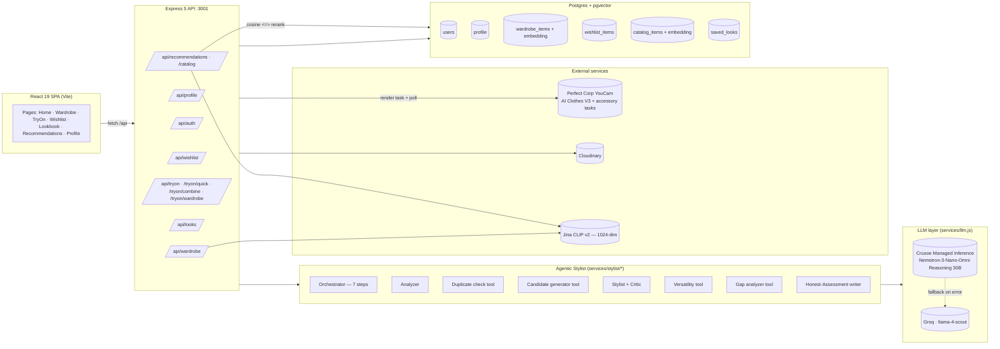
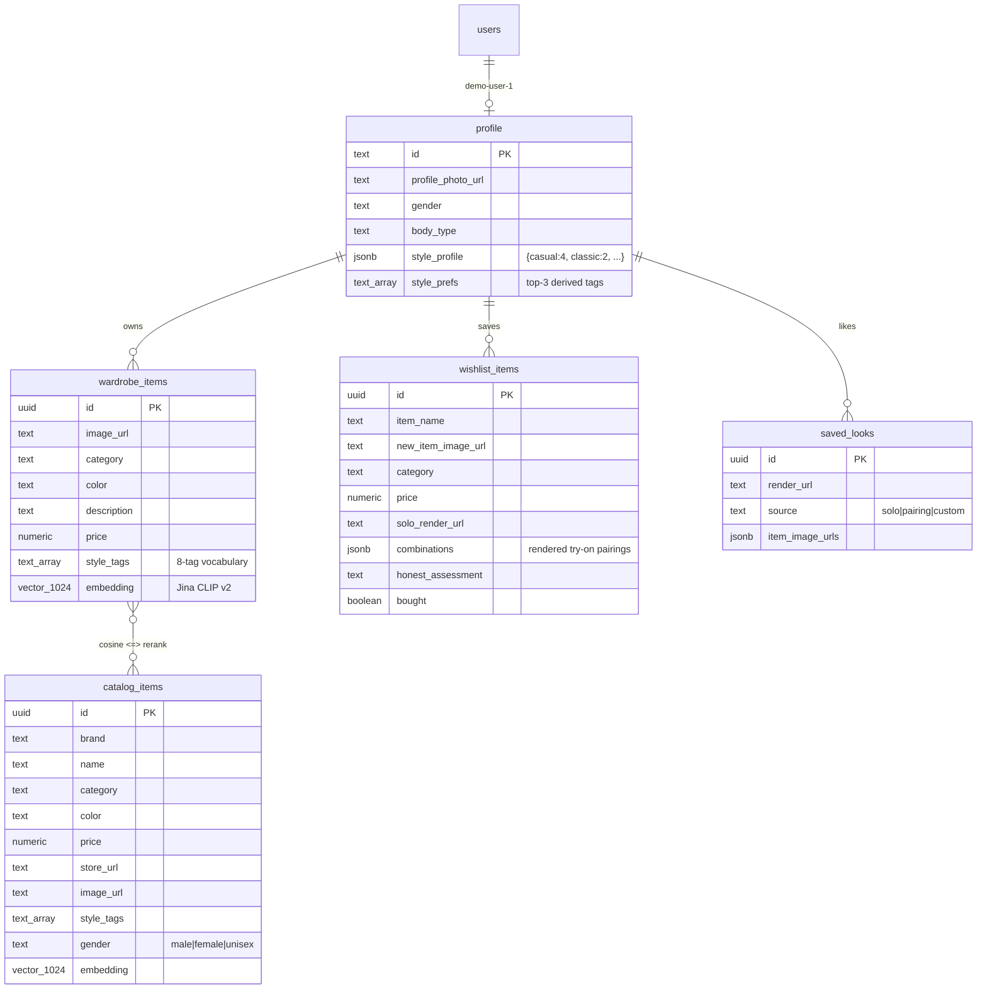
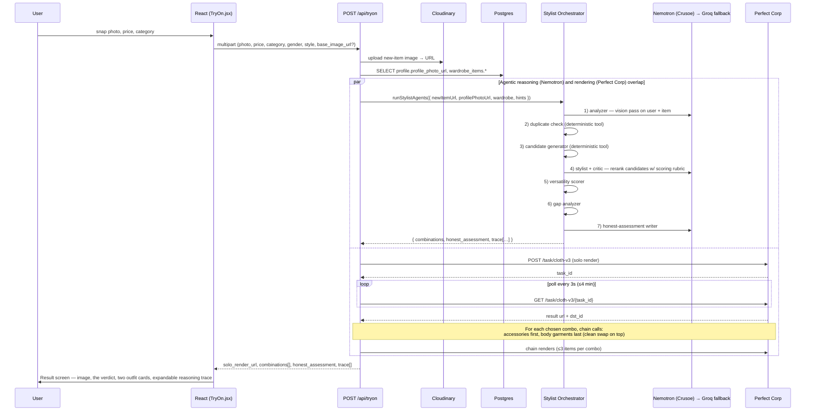
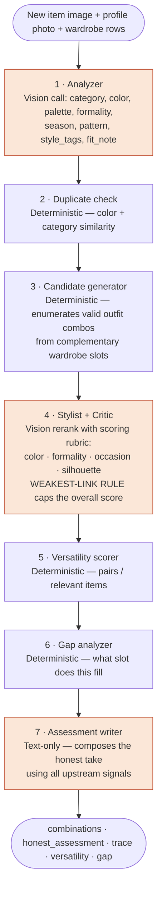
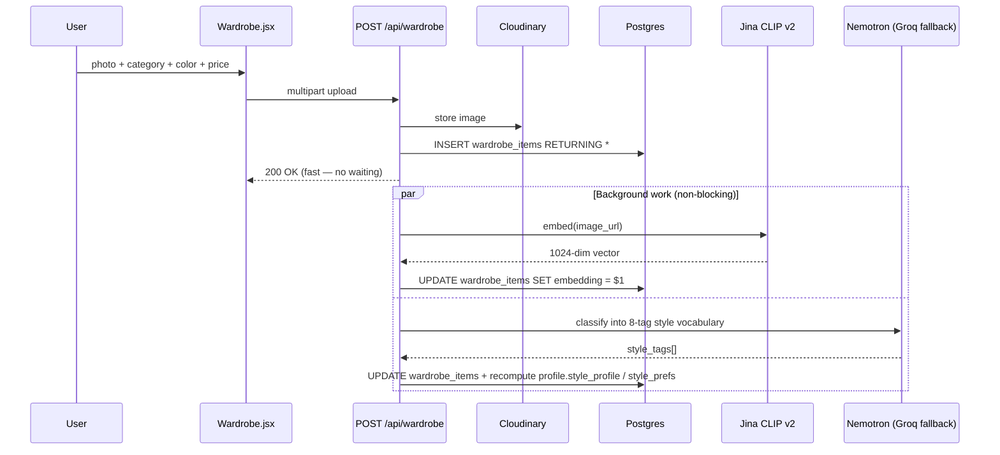
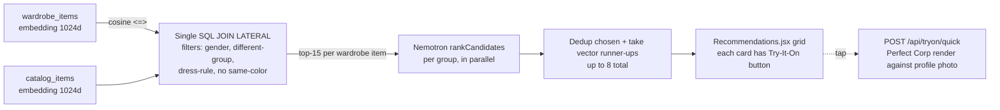
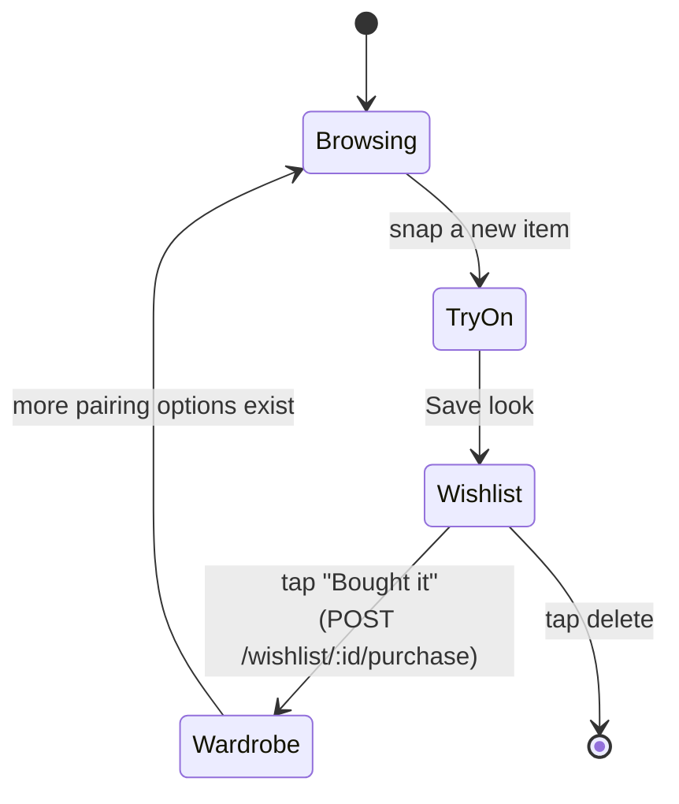
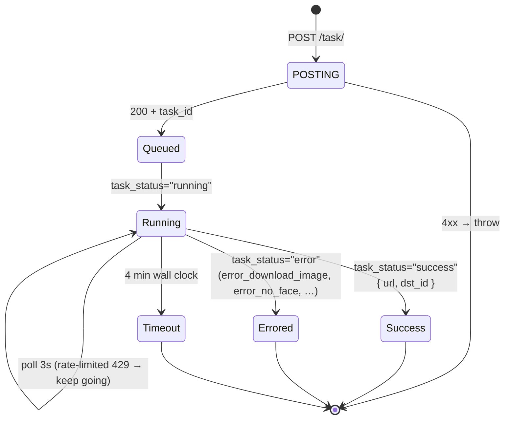
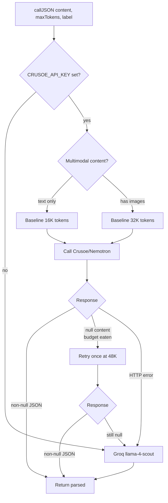

# Closet — Technical Design Doc

**Hackathon:** DevNetwork [AI + ML] Hackathon 2026 — Perfect Corp track
**Pitch (one line):** A wardrobe that thinks back — AI virtual try-on grounded in clothes you already own, with an honest assessment that's allowed to say "skip it."

---

## 1 · Stack at a glance

| Layer            | Choice                                                          |
| ---------------- | --------------------------------------------------------------- |
| Frontend         | React 19 + Vite 8 + React Router 7 + Tailwind 4                 |
| Backend          | Node.js + Express 5 (CommonJS)                                  |
| Database         | PostgreSQL with `pgvector` (cosine sim) + `pgcrypto` (UUIDs)    |
| Image hosting    | Cloudinary (mirrors every external image to a stable public URL) |
| Virtual try-on   | Perfect Corp YouCam — AI Clothes V3 + per-accessory endpoints   |
| Stylist LLM      | **NVIDIA Nemotron-3-Nano-Omni-Reasoning-30B-A3B** via Crusoe Managed Inference (primary) |
| LLM fallback     | Groq (`meta-llama/llama-4-scout-17b-16e-instruct`)              |
| Image embeddings | Jina CLIP v2 (1024-dim), stored in `pgvector`                    |
| Auth             | Email + password, salted SHA-256, bearer token in `users.token` |
| Dev proxy        | Vite proxies `/api → http://localhost:3001`                     |

**Single binary surface:** the React app is statically hosted; everything talks to one Express server on port 3001. All third-party keys (Cloudinary, Perfect Corp, Crusoe, Groq, Jina) stay server-side, validated at boot in [Closet/server/config.js](Closet/server/config.js).

---

## 2 · System architecture

The visual version is in [d1-architecture.svg](d1-architecture.svg). Mermaid equivalent (renders in GitHub/VSCode):



**Three external dependencies, three jobs:**

- **Cloudinary** — stable public URLs (Perfect Corp can only fetch images from direct image URLs; we mirror everything, even catalog product images, through [services/cloudinary.js](Closet/server/services/cloudinary.js)).
- **Perfect Corp** — the actual visual try-on rendering. Async task API: POST to start, poll every 3s until `success` or `error`.
- **Crusoe / Nemotron** — every reasoning step in the stylist agent. Groq is the safety net.
- **Jina CLIP v2** — image → 1024-dim vector. Vectors live in Postgres so we can use a single `<=>` (cosine distance) operator for the whole "you own X, here's a catalog Y that pairs" recommender.

---

## 3 · Data model

Defined in [Closet/server/db/schema.sql](Closet/server/db/schema.sql). Single demo user (`id = 'demo-user-1'`) so the schema stays lean.



**Why pgvector:**

- Two IVFFlat indexes (`catalog_embedding_idx`, `wardrobe_embedding_idx`) with `vector_cosine_ops`.
- One SQL query in [routes/recommendations.js](Closet/server/routes/recommendations.js#L93-L156) handles vector recall, category-group exclusion (don't pair jeans with jeans), gender filter, dress-is-a-full-outfit rule, and same-color suppression in a single round-trip.
- Re-ranking happens in Node afterwards via the Nemotron `rankCandidates` call ([services/llm.js:163](Closet/server/services/llm.js#L163)).

---

## 4 · API surface

Mounted in [Closet/server/index.js](Closet/server/index.js).

```
# Auth
POST   /api/register            email+password → bearer token
POST   /api/login               returns rotated token
GET    /api/me                  whoami
PATCH  /api/password

# Profile
POST   /api/profile/photo       multipart → Cloudinary → profile.profile_photo_url
GET    /api/profile
PATCH  /api/profile             name, gender, body_type, heights, sizes
PATCH  /api/profile/preferences gender, bodyType (used during onboarding)
DELETE /api/profile

# Wardrobe
GET    /api/wardrobe
POST   /api/wardrobe            multipart upload → Cloudinary → background embed + style classify
POST   /api/wardrobe/from-url   used by "Bought it" — image already on Cloudinary
DELETE /api/wardrobe/:id

# Wishlist
GET    /api/wishlist
POST   /api/wishlist            save a try-on result (dedup by image URL)
POST   /api/wishlist/:id/purchase   move into wardrobe ("Bought it")
DELETE /api/wishlist/:id

# Try-on (the heart of the app)
POST   /api/tryon               new item + photo → agentic stylist + Perfect Corp chained render
POST   /api/tryon/quick         catalog item + optional 1 wardrobe pairing (Recommendations)
POST   /api/tryon/combine       new item + user-chosen wardrobe ids (manual composer)
POST   /api/tryon/wardrobe      wardrobe-only Mix & Match (no new item)

# Looks (the "Lookbook")
GET    /api/looks
POST   /api/looks               dedup by render_url
DELETE /api/looks/:id

# Catalog & recommendations
GET    /api/catalog
POST   /api/catalog
POST   /api/catalog/embed-all   batch-fill missing Jina embeddings
GET    /api/recommendations     pgvector retrieve → Nemotron rerank → top-8
```

The frontend never calls `fetch` directly — everything routes through [app/src/api/client.js](Closet/app/src/client.js) which attaches the bearer token and normalizes errors.

---

## 5 · The core try-on flow (the demo moment)

Original sequence diagram: [d2-tryon-flow.svg](d2-tryon-flow.svg). The current implementation is richer — the single Claude call has been replaced by a **7-step Nemotron agent**.



**Key implementation notes:**

- **Two layers run in parallel.** The LLM agent (seconds) and the Perfect Corp render (~25s/call) are launched via `Promise.all` in [routes/tryon.js](Closet/server/routes/tryon.js) — the user only waits for the slower one.
- **Chained renders, deterministic ordering.** [services/perfectCorp.js:133](Closet/server/services/perfectCorp.js#L133) sorts steps so accessories render first (their endpoints regenerate the entire outfit, so they can't go last) and body garments render last (`cloth-v3` is a clean garment-only swap that overlays the real garment back on top). The new item renders last within its group so it sits on top.
- **Accessory solo render is skipped on purpose.** Hats/scarves/bags/shoes endpoints hallucinate a full outfit; we route the user straight to the closet picker so the chained body-garment render restores their real clothes.
- **Reasoning trace is part of the API response.** Every agent step pushes a human-readable line into `trace[]` ([orchestrator.js:12](Closet/server/services/stylist/orchestrator.js#L12)) — the UI surfaces this in a "How the stylist thought about this" panel, which is the differentiator on demo day.

---

## 6 · The agentic stylist (this is the novel part)

The single-shot Claude prompt from the original spec has evolved into a **deterministic 7-node agent** ([services/stylist/orchestrator.js](Closet/server/services/stylist/orchestrator.js)). Each node has a narrow job; the LLM only does what an LLM is good at.



Orange nodes = LLM calls (Nemotron-first). White nodes = deterministic JS tools. **The LLM never sees the full wardrobe** — the candidate generator narrows it to a small set so the stylist agent only reranks, never invents IDs.

### Why Nemotron specifically

- **Built-in reasoning trace.** Nemotron-3-Nano-Omni emits a chain-of-thought before its JSON answer. We size `max_tokens` with a buffer (text: 16K, multimodal: 32K) and retry once at 48K if the budget gets eaten — see [services/llm.js:64-108](Closet/server/services/llm.js#L64-L108).
- **Multimodal.** Same content shape as OpenAI (`type: 'image_url'`), so swapping providers is one config flag (`CRUSOE_API_KEY`).
- **Crusoe-first, Groq-fallback at the call site.** Each LLM step independently falls back; one failure doesn't tank the whole pipeline.

### The scoring rubric (anti-sycophancy)

Critic prompts include a **tight** rubric defined once in [services/llm.js:145-159](Closet/server/services/llm.js#L145-L159):

- Default for a random pairing is 5–6, not 8+.
- Same-hue repetition caps color score at 5.
- Neutrals don't count toward harmony.
- **Weakest-link rule:** if any axis is ≤4, overall cannot exceed 6.

This is why the app is allowed to say "skip this" — the rubric forces low scores onto bad pairings, and the assessment writer mirrors that into prose.

---

## 7 · Add-to-wardrobe flow

Original diagram: [d3-add-wardrobe.svg](d3-add-wardrobe.svg). Current code in [routes/wardrobe.js](Closet/server/routes/wardrobe.js).



Two side-effects fire in the background after the row is returned to the client: the Jina embed (for future recommendations) and the Nemotron style classification (which feeds the **radar chart** on the Profile page).

---

## 8 · Recommendations flow (pgvector + LLM rerank)

One SQL query does the heavy lifting; the LLM only sees the top-15 per wardrobe slot.



**Failure-tolerant:** if Nemotron rerank fails, the top vector match is used. If embeddings are missing for any row, they're lazily computed at query time ([routes/recommendations.js:74-90](Closet/server/routes/recommendations.js#L74-L90)).

---

## 9 · "Bought it" loop — the compounding mechanic

Original state diagram: [d4-bought-it.svg](d4-bought-it.svg). The point: every purchased item becomes a future pairing option, so the recommender gets smarter the more the user uses the app.



Single endpoint: [routes/wishlist.js:32](Closet/server/routes/wishlist.js#L32) atomically inserts into `wardrobe_items` and deletes the `wishlist_items` row.

---

## 10 · Page-by-page component order

Routing lives in [app/src/App.jsx](Closet/app/src/App.jsx). Each feature has its own `useXxx` hook that owns data + side effects; the `.jsx` is presentational.

### 10.1 — Login `/`
1. Email + password form → `POST /api/login`
2. Token stored via `lib/session.js` (localStorage)
3. Redirect to `/onboarding` if profile incomplete, else `/wardrobe`

### 10.2 — Onboarding `/onboarding`
[useOnboarding.js](Closet/app/src/features/onboarding/useOnboarding.js)
1. On mount: `GET /api/profile`, reconcile against localStorage (handles DB resets)
2. Steps: photo picker → gender → body type
3. `compressPhoto` downscales client-side to ≤1600px @ JPEG 0.85
4. `POST /api/profile/photo` (multipart) → `PATCH /api/profile/preferences`
5. `navigate('/wardrobe')`

### 10.3 — Home `/` (signed-in)
[useHome.js](Closet/app/src/features/home/useHome.js) — dashboard
1. Reads profile from session
2. `GET /api/wardrobe` to compute item count + total closet value
3. CTAs to the four primary flows

### 10.4 — Wardrobe `/wardrobe`
[useWardrobe.js](Closet/app/src/features/wardrobe/useWardrobe.js) — the home base
1. Mount: `GET /api/wardrobe`
2. Side-derived: filter (category), color filter, favorites (localStorage), search
3. Add item: `POST /api/wardrobe` (multipart) — background embed + classify
4. Delete: `DELETE /api/wardrobe/:id` (also destroys from Cloudinary + recomputes profile style)
5. **Mix & Match mode** ("Try It On"): pick up to 4 owned pieces → `POST /api/tryon/wardrobe` → modal with composite + agentic outfit critique

### 10.5 — Try-On Capture `/tryon`
[useTryOn.js](Closet/app/src/features/tryon/useTryOn.js)
1. Photo picker + price + category + color + store
2. Rotating status messages while waiting (5s cadence)
3. `POST /api/tryon` (multipart) — see flow in §5
4. On success: `setLastResult` → `navigate('/tryon/result')`

### 10.6 — Try-On Result `/tryon/result`
1. Hero image (solo render or accessory-skipped state)
2. **Honest assessment block** — the verdict in plain language
3. Two outfit cards, each with composite render + styling note + itemized pieces (new item flagged terracotta)
4. **Reasoning Trace panel** ([StylistTracePanel.jsx](Closet/app/src/features/tryon/StylistTracePanel.jsx)) — collapsible per-step trace, shows the score breakdown, the critic's prose, the verdict quote
5. Like button → `POST /api/looks` (Lookbook). Save → `POST /api/wishlist`

### 10.7 — Wishlist `/wishlist`
1. `GET /api/wishlist`
2. Each card shows render + assessment + bought toggle
3. **Bought it** → `POST /api/wishlist/:id/purchase` → row migrates to `wardrobe_items`

### 10.8 — Lookbook `/looks`
1. `GET /api/looks` — saved generated renders, grouped by source (solo / pairing / custom)
2. Tap a saved look → "Style this look" path: re-enters `/tryon` with `base_image_url` set to the saved render (the renderer layers a new item onto that canvas instead of the bare profile photo)

### 10.9 — Recommendations `/recommendations`
1. `GET /api/recommendations` — flow in §8
2. Card per wardrobe item with the best catalog match, "Try It On" button → `POST /api/tryon/quick`

### 10.10 — Profile `/profile`
1. `GET /api/profile` — pulls `style_profile` (count map) + `style_prefs` (top 3)
2. **Radar chart** keyed off the 8-tag style vocabulary in [services/styleProfile.js:12](Closet/server/services/styleProfile.js#L12) — must stay in sync with `STYLE_LABELS` in the frontend
3. Edit form → `PATCH /api/profile`

### 10.11 — Settings `/settings`
Password change → `PATCH /api/password`. Profile reset → `DELETE /api/profile`.

### 10.12 — Catalog Admin `/admin/catalog`
1. `GET /api/catalog`
2. `POST /api/catalog` to add → embeds on insert
3. `POST /api/catalog/embed-all` to backfill missing vectors

---

## 11 · Perfect Corp task lifecycle

[d5-task-lifecycle.svg](d5-task-lifecycle.svg). Implementation: [services/perfectCorp.js:84](Closet/server/services/perfectCorp.js#L84).



**Two endpoint families:**

- **Body garments** → `/task/cloth-v3` (single garment per call, but `dst_id` chains them)
- **Accessories** → `/task/hat`, `/task/scarf`, `/task/bag`, `/task/shoes` (requires `gender`; optionally `style`)

Chaining: render output's `dst_id` would be the next call's `src_id`. We pass the result URL as `src_file_url` since Perfect Corp accepts that too — simpler bookkeeping.

---

## 12 · LLM call site (one place, two providers)

[services/llm.js](Closet/server/services/llm.js) is the single entrypoint for any "give me JSON from a prompt + some images" need. Crusoe-first, Groq-fallback, with two reasoning-token tactics specific to Nemotron:



**Why the tiered budget matters for the hackathon:** Nemotron's chain-of-thought scales with image count. The wardrobe Mix-&-Match agent sometimes passes 5+ images; if we sized for the worst case every call, we'd burn tokens for nothing. The two-stage approach keeps the common case cheap and only escalates when needed.

---

## 13 · Things to call out in the hackathon pitch

Things judges will recognize as **not the default React-LLM-API hackathon shape**:

1. **The Nemotron reasoning trace is visible in the product.** The "How the stylist thought about this" panel is a feature, not a debug view. It is rare to see a multi-step agent expose its trace at consumer-grade polish.
2. **The honest-assessment is allowed to push back.** The rubric in [llm.js:145](Closet/server/services/llm.js#L145) is anchored to be a real critic (default 5–6/10), not a sycophant. Most generative shopping demos can't say no.
3. **pgvector + LLM rerank instead of vector-only.** Single SQL pulls top-15 per wardrobe item with full business logic (gender, category-group exclusion, dress-is-a-full-outfit, no same-color); then Nemotron picks the winner per slot. ~8 LLM calls total across the entire recommendations page, parallelized.
4. **The render pipeline is order-aware.** Accessories first, body garments last — discovered the hard way (clothes endpoint repaints the torso, so anything painted on top of the torso gets clobbered). [perfectCorp.js:133](Closet/server/services/perfectCorp.js#L133) sorts the steps for you.
5. **Two-tier reasoning budget for Nemotron.** Text-only 16K, multimodal 32K, retry-at-48K only on null content. Most teams hit Nemotron once, get a null response, and silently fall back to a smaller model — we keep the prize-relevant Crusoe path alive without overpaying.
6. **Agentic try-on runs in parallel with Perfect Corp.** `Promise.all([stylistAgent, render])`. Stylist takes seconds, render takes ~25s/garment — total wait stays render-bound.
7. **Background side-effects on wardrobe add.** Response returns immediately; Jina embed + Nemotron style classification + style-profile rollup happen async. The user never waits for them.
8. **Bought-it loop is the compounding mechanic.** Every purchased wishlist item becomes new pairing inventory — the recommender gets better the more you use it. This is the "moat" framing for the pitch.
9. **One Perfect Corp account, every accessory type.** Hats, scarves, bags, shoes each have their own task endpoint; we route by category in [perfectCorp.js:30-44](Closet/server/services/perfectCorp.js#L30-L44). Most hackathon entries only use `/task/cloth`.
10. **Single SPA, single API, no microservices.** The whole stack runs locally on two ports (5173 + 3001). Easy to demo with no DevOps story.

---

## 14 · File map (where to look during the demo)

| What                          | File                                                                  |
| ----------------------------- | --------------------------------------------------------------------- |
| App bootstrap                 | [server/index.js](Closet/server/index.js)                             |
| Env + provider keys           | [server/config.js](Closet/server/config.js)                           |
| Schema                        | [server/db/schema.sql](Closet/server/db/schema.sql)                   |
| Catalog seed                  | [server/db/seed.js](Closet/server/db/seed.js)                         |
| Main try-on endpoint          | [server/routes/tryon.js](Closet/server/routes/tryon.js)               |
| Recommendations + pgvector    | [server/routes/recommendations.js](Closet/server/routes/recommendations.js) |
| Agent orchestrator (7 steps)  | [server/services/stylist/orchestrator.js](Closet/server/services/stylist/orchestrator.js) |
| LLM call site (Crusoe + Groq) | [server/services/llm.js](Closet/server/services/llm.js)               |
| Perfect Corp render chain     | [server/services/perfectCorp.js](Closet/server/services/perfectCorp.js) |
| Jina CLIP v2 embeddings       | [server/services/fashionclip.js](Closet/server/services/fashionclip.js) |
| Style classifier + rollup     | [server/services/styleProfile.js](Closet/server/services/styleProfile.js) |
| Routing                       | [app/src/App.jsx](Closet/app/src/App.jsx)                             |
| API client                    | [app/src/api/client.js](Closet/app/src/api/client.js)                 |
| Try-on UI                     | [app/src/features/tryon/](Closet/app/src/features/tryon/)             |
| Trace panel (the demo wow)    | [app/src/features/tryon/StylistTracePanel.jsx](Closet/app/src/features/tryon/StylistTracePanel.jsx) |
